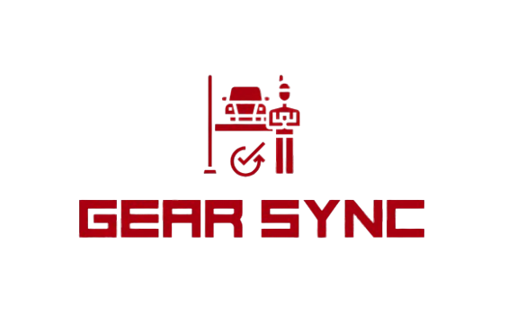

# 🔧 GearSync - Vehicle Service Management System

<div align="center">
  
  <h3>Your Complete Vehicle Maintenance Solution</h3>
  <p><em>Connecting vehicle owners with trusted service providers and car wash facilities for seamless automotive care.</em></p>
</div>

---

## 📖 About GearSync

**GearSync** is a comprehensive vehicle service management application built with JavaFX that bridges the gap between vehicle owners and service providers. Our platform creates a unified ecosystem where customers can effortlessly request services, purchase genuine parts, book professional car wash services, and maintain direct communication with certified mechanics and service workers.

We believe that vehicle maintenance should be transparent, convenient, and trustworthy. GearSync empowers vehicle owners to take control of their automotive care while providing service providers with the tools they need to deliver exceptional customer experiences.

---

## 🛠️ Technologies Used

### Core Technologies
- **Java 23** - Modern programming language with latest features
- **JavaFX 17** - Rich desktop application framework for stunning UI
- **MySQL** - Robust relational database management system
- **Maven** - Comprehensive project build and dependency management
- **FXML** - Declarative UI layout and scene design

### Libraries & Frameworks
- **iText PDF 7.2.5 & 5.5.13** - Professional PDF generation for invoices and receipts
- **JavaFX Controls, FXML, Web, Swing** - Complete UI component suite
- **ControlsFX** - Advanced JavaFX controls and dialogs
- **FormsFX** - Enhanced form handling and validation
- **TilesFX** - Interactive dashboard and data visualization components
- **BootstrapFX** - Bootstrap-inspired styling for JavaFX
- **Ikonli** - Comprehensive icon library integration

### Development Tools
- **JUnit 5** - Modern unit testing framework
- **IntelliJ IDEA** - Recommended IDE for development
- **XAMPP** - Local development server for database management

---

## ✨ Features

### 👥 **Customer Features**
- **Service Request Management** - Submit detailed service requests with vehicle information and images
- **Parts Marketplace** - Browse and purchase genuine vehicle parts with real-time inventory tracking
- **Car Wash Booking** - Schedule professional car wash services with multiple packages (Basic, Deluxe, Premium)
- **Invoice & Receipt Management** - Generate, view, and download PDF invoices for all transactions
- **Real-time Communication** - Direct chat with assigned mechanics and customer support
- **Profile & Vehicle Management** - Comprehensive profile and vehicle information management

### 🔧 **Worker/Mechanic Features**
- **Service Request Dashboard** - View, accept, and manage incoming service requests
- **Customer Communication Hub** - Real-time chat with customers about service details and progress
- **Service Status Tracking** - Update and track service progress from start to completion
- **Professional Profile Management** - Manage credentials, specializations, and availability
- **Work History & Analytics** - Track completed jobs and performance metrics

### 👨‍💼 **Administrator Features**
- **User Management System** - Comprehensive customer and worker account administration
- **Parts Inventory Control** - Add, update, and manage vehicle parts catalog with pricing
- **Car Wash Service Configuration** - Create and manage car wash packages and pricing structures
- **Business Analytics Dashboard** - View comprehensive statistics and business insights
- **Communication Oversight** - Monitor and participate in customer-worker communications
- **System Configuration** - Manage platform settings and service offerings

### 🔒 **Security & System Features**
- **Multi-role Authentication** - Secure login system with role-based access control
- **PDF Document Generation** - Automated invoice and receipt creation with professional formatting
- **Image Management System** - Secure upload and management of vehicle and profile images
- **Real-time Messaging Platform** - Integrated chat system for seamless communication
- **Service Lifecycle Tracking** - Complete management from request to completion
- **Inventory Management** - Real-time parts availability and automated stock tracking

---

## 🚀 Getting Started

### Prerequisites
- **Java Development Kit (JDK) 17 or higher**
- **Apache Maven 3.6 or higher**
- **MySQL Server 8.0 or higher**
- **XAMPP** (recommended for local database setup)
- **IntelliJ IDEA** (recommended IDE)

### Installation Steps

1. **Download and Install Prerequisites**
   ```
   Download XAMPP from: https://www.apachefriends.org/
   Install Java JDK 17+ and Maven
   Download IntelliJ IDEA Community Edition
   ```

2. **Clone or Download the Project**
   ```bash
   # Option 1: Clone the repository
   git clone https://github.com/M-R-Saad/GearSync.git
   cd GearSync
   
   # Option 2: Download ZIP and extract
   ```

3. **Setup Database**
   - Start XAMPP and enable Apache and MySQL services
   - Open phpMyAdmin in your browser: `http://localhost/phpmyadmin`
   - Create a new database named `gear_sync`
   - Import the SQL file: `src/main/resources/db/gear_sync.sql`
   - Verify all tables are created successfully with sample data

4. **Configure Database Connection**
   - Locate database configuration files in the project
   - Update MySQL connection settings if necessary:
   ```java
   // Default configuration
   Host: localhost
   Port: 3306
   Database: gear_sync
   Username: root
   Password: (leave empty for XAMPP default)
   ```

5. **Build and Launch the Application**
   - Open the project in IntelliJ IDEA
   - Wait for Maven to download all dependencies
   - Navigate to `src/main/java/org/example/vehicle/Login.java`
   - Right-click and select "Run Login.main()"
   - The application will launch with the login interface

6. **Test with Sample Data**
   - Use the imported sample data to test different user roles
   - Create new accounts through the signup interface
   - Explore all features and functionalities

### 📁 Project Structure
```
GearSync/
├── src/main/
│   ├── java/org/example/vehicle/        # Java source files
│   │   ├── *Controller.java             # JavaFX controllers for UI logic
│   │   ├── Login.java                   # Main application entry point
│   │   ├── Customer.java                # Customer model and operations
│   │   ├── Worker.java                  # Worker model and operations
│   │   ├── Service.java                 # Service management
│   │   ├── CarWash.java                 # Car wash service management
│   │   ├── Parts.java                   # Vehicle parts management
│   │   └── *.java                       # Additional model classes
│   └── resources/
│       ├── org/example/vehicle/         # FXML files for UI layouts
│       ├── css/stylesheet.css           # Custom styling
│       ├── db/gear_sync.sql            # Database schema and sample data
│       └── files/                       # Application resources
├── target/                              # Compiled classes and resources
├── lib/                                 # External libraries (iText jars)
├── user_images/                         # User profile pictures
├── vehicle_images/                      # Vehicle-related images
├── vehicle_parts/                       # Parts catalog images
├── vehicle_wash/                        # Car wash service images
├── pom.xml                             # Maven configuration
└── README.md                           # This file
```

---

## 🎯 Usage Guide

### For Vehicle Owners/Customers:
1. **Register/Login** - Create a customer account or log in to existing account
2. **Submit Service Requests** - Describe vehicle issues with photos and details
3. **Browse Parts** - Shop for genuine vehicle parts with detailed specifications
4. **Book Car Wash Services** - Schedule professional cleaning with preferred packages
5. **Track Services** - Monitor service progress and communicate with mechanics
6. **Manage Invoices** - View transaction history and download PDF receipts

### For Mechanics/Service Workers:
1. **Professional Registration** - Create worker profile with credentials and specializations
2. **Accept Service Requests** - View and accept jobs that match your expertise
3. **Update Service Progress** - Keep customers informed throughout the service process
4. **Manage Schedule** - Set availability and manage workload efficiently
5. **Customer Communication** - Provide updates and answer questions through integrated chat

### For Administrators:
1. **System Oversight** - Monitor platform activity and user engagement
2. **Inventory Management** - Add new parts, update prices, and manage stock levels
3. **Service Configuration** - Create new service types and pricing structures
4. **User Management** - Verify worker credentials and manage user accounts
5. **Analytics & Reporting** - Access business insights and performance metrics

---

## 🤝 Contributing

We welcome contributions to improve GearSync! Here's how you can help:

1. **Fork the repository**
2. **Create a feature branch** (`git checkout -b feature/AmazingFeature`)
3. **Commit your changes** (`git commit -m 'Add some AmazingFeature'`)
4. **Push to the branch** (`git push origin feature/AmazingFeature`)
5. **Open a Pull Request**

### Areas for Contribution:
- User interface and user experience improvements
- Security enhancements and vulnerability fixes
- Performance optimizations and code refactoring
- Additional features (mobile app, web interface, etc.)
- Bug fixes and comprehensive testing
- Documentation improvements and translations

---

## 📄 License

This project is licensed under the MIT License - see the [LICENSE](LICENSE) file for details.

---

## 🆘 Support & Contact

If you encounter any issues or have questions:

- **GitHub Issues**: [Create an issue](https://github.com/M-R-Saad/GearSync/issues)
- **Email**: support@gearsync.com
- **Project Link**: [https://github.com/M-R-Saad/GearSync](https://github.com/M-R-Saad/GearSync)

---

## 🙏 Acknowledgments

- **Oracle JavaFX Team** for the comprehensive desktop application framework
- **iText Software** for the powerful PDF generation capabilities
- **MySQL** for the robust database management system
- **Apache Maven** for streamlined project management
- **ControlsFX Community** for enhanced JavaFX components
- All contributors and testers who helped improve this platform

---

<div align="center">
  <h3>🔧 Keep Your Vehicle Running Smoothly with GearSync 🔧</h3>
  <p><em>Join thousands of vehicle owners who trust GearSync for their automotive maintenance needs</em></p>
  <p><strong>Your vehicle's best care starts here!</strong></p>
</div>

---

*© 2025 GearSync. All rights reserved. | Vehicle maintenance made simple*
